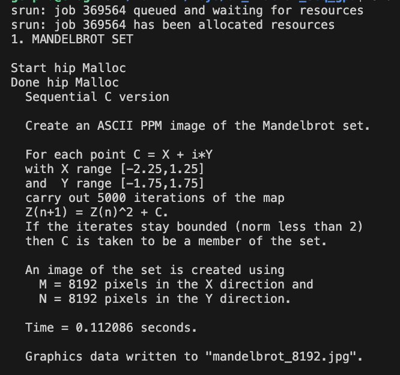
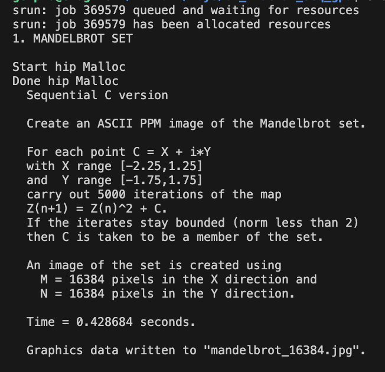
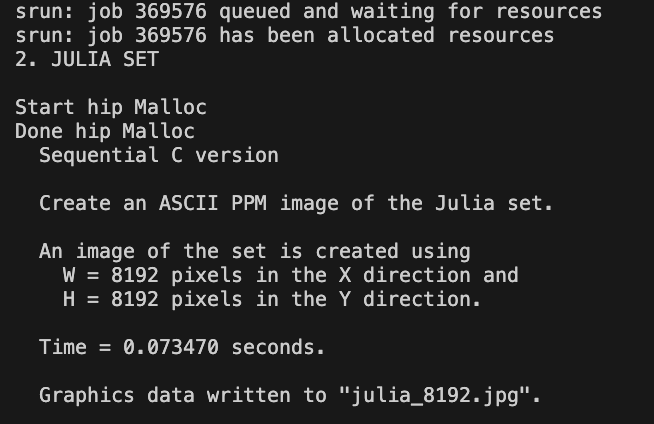
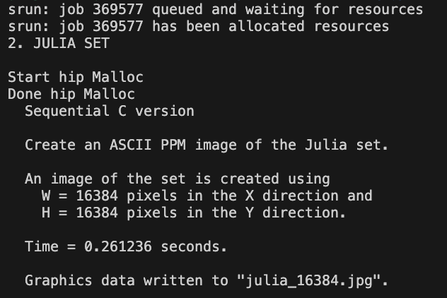

## Toy project 01 Fractal - Nguyen Hoang Thuan

### Solution

The problem is create an imaginary picture by calculating each pixel value and assigned it to target array. In CPU version each pixel in target picture is considered 1 time and value of each pixel is independence with each others. For that reason, we can parallelize this part using GPU, in which, each thread will calculate value of a pixel and paste it to target array parallely.

To solve it with HIP - to run in GPU architecture, we need to define include the run time, CHECK_HIP error for every hip function call, and the block size of a thread block.

```
#include <hip/hip_runtime.h>
#include "timers.h"
#define CHECK_HIP(cmd)                                                                            
  do                                                                                                 
  {                                                                                                  
    hipError_t error = cmd;                                                                          
    if (error != hipSuccess)                                                                         
    {                                                                                                
      fprintf(stderr, "HIP Error: %s (%d): %s:%d\n", hipGetErrorString(error), error, __FILE__, __LINE__); 
      exit(EXIT_FAILURE);                                                                            
    }                                                                                                
  } while (0)
#define TILE_SIZE 1
#define BLOCK_SIZE 16
```

Because each pixel in target only be accessed 1 time, so we shouldn't use share memory or tiling technique which is only reduce performance, but for experiment purpose, I still implement using tiling 2D with TILE_SIZE - (each thread will calculate a matrix TILE_SIZExTILE_SIZE in the target picture ).

Next, we need to declare and alloc memory for Array in both GPU and CPU. The hipHostMalloc function will malloc the memory in the pinned memory so it help transfer data between GPU and CPU much faster.

```
int *r_gpu, *g_gpu, *b_gpu, *r, *g, *b;
printf("Start hip Malloc\n");
CHECK_HIP(hipMalloc((void **)&r_gpu, m * n * sizeof(int)));
CHECK_HIP(hipMalloc((void **)&g_gpu, m * n * sizeof(int)));
CHECK_HIP(hipMalloc((void **)&b_gpu, m * n * sizeof(int)));
printf("Done hip Malloc\n");

CHECK_HIP(hipHostMalloc((void **)&r, m * n * sizeof(int)));
CHECK_HIP(hipHostMalloc((void **)&g, m * n * sizeof(int)));
CHECK_HIP(hipHostMalloc((void **)&b, m * n * sizeof(int)));

hipStream_t streams[3];

for (i = 0; i < 3; i++)
{
    CHECK_HIP(hipStreamCreate(&streams[i]));
}

```

I also create 3 streams to transfer 3 array r_gpu, g_gpu, b_gpu to main memory parallely and reduce total time transfer compare to using the default stream.

Next, I will call kernel to execute

```
dim3 blockdim(BLOCK_SIZE, BLOCK_SIZE);
dim3 griddim(((m + TILE_SIZE - 1) / TILE_SIZE + blockdim.x - 1) / blockdim.x, ((n + TILE_SIZE - 1) / TILE_SIZE + blockdim.y - 1) / blockdim.y);

gpu_mandelbrot<<<griddim, blockdim>>>(r_gpu, g_gpu, b_gpu, m, n);
```

After finish calculating I transfer result to cpu.

```
  CHECK_HIP(hipMemcpyAsync(r, r_gpu, m * n * sizeof(int), hipMemcpyDeviceToHost, streams[0]));
  CHECK_HIP(hipMemcpyAsync(g, g_gpu, m * n * sizeof(int), hipMemcpyDeviceToHost, streams[1]));
  CHECK_HIP(hipMemcpyAsync(b, b_gpu, m * n * sizeof(int), hipMemcpyDeviceToHost, streams[2]));

  CHECK_HIP(hipStreamSynchronize(streams[0]));
  CHECK_HIP(hipStreamSynchronize(streams[1]));
  CHECK_HIP(hipStreamSynchronize(streams[2]));
  CHECK_HIP(hipDeviceSynchronize());
```

All the stream[0] - [1] - [2], only executed after the default stream is finished.

After done transfer data we need to call StreamSynchronize or DeviceSynchronize to wait all task done before exit time measuring.

The make file is built as follow

```
HIP_PATH?= $(wildcard /opt/rocm)
HIPCC=$(HIP_PATH)/bin/hipcc
CXX=$(HIPCC)
LD=$(HIPCC)
# CFLAGS  = -O3 -Wall -g -DSAVE_JPG  
CPPFLAGS=-std=c++17 -O3 -Wall -DSAVE_JPG  -fopenmp --offload-arch=gfx908
LDFLAGS	= -lm -ljpeg

EXE = fractals
CXXFILES	=	$(wildcard *.cc)
OBJECTS	=	$(CXXFILES:.cc=.o)

all: $(EXE)

$(EXE) : $(OBJECTS)
	$(LD) -o $@ $^ $(CPPFLAGS) $(LDFLAGS) 

%.o : %.cc
	$(CXX) -c $< -o $@  $(CPPFLAGS)

clean :
	rm -f $(EXE) $(OBJECTS) *.ppm

```

(*) Note that the transfer data also include in time measuring.
The implementation flow for mandelbrot and julia are the same.

### Experiment

#### Mandelbrot

This is the experiment result for Mandelbrot for size 8192 and 16384






#### Julia

This is the experiment result for Julia for size 8192 and 16384






