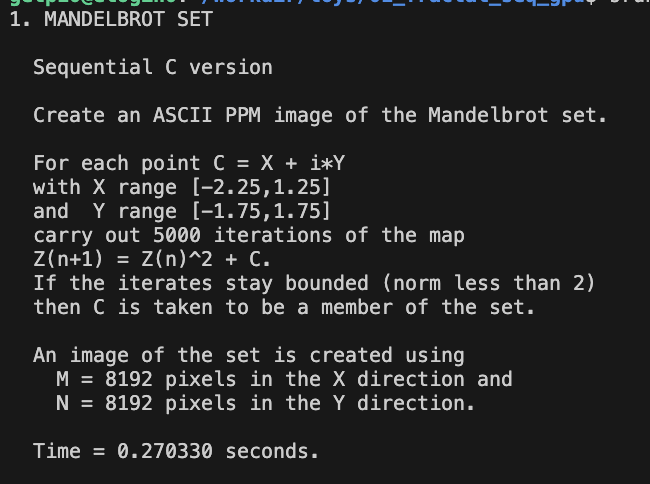
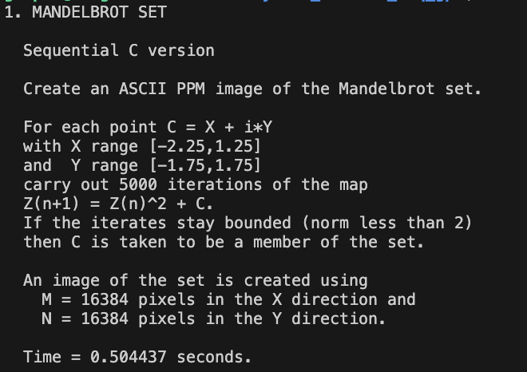
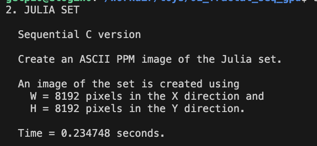
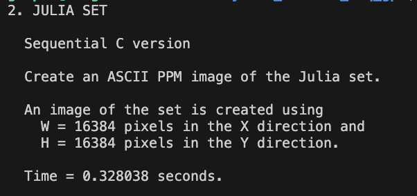

## Toy project 01 Fractal - Nguyen Hoang Thuan

### Solution

The problem is create an imaginary picture by calculating each pixel value and assigned it to target array. In CPU version each pixel in target picture is considered 1 time and value of each pixel is independence with each others. For that reason, we can parallelize this part using GPU, in which, each thread will calculate value of a pixel and paste it to target array parallely.

To solve it with HIP - to run in GPU architecture, we need to define include the run time, CHECK_HIP error for every hip function call, and the block size of a thread block.

```
#include <hip/hip_runtime.h>
#include "timers.h"
#define CHECK_HIP(cmd)                                                                    
  do                                                                                         
  {                                                                                          
    hipError_t error = cmd;                                                                  
    if (error != hipSuccess)                                                                 
    {                                                                                        
      fprintf(stderr, "HIP Error: %s (%d): %s:%d\n", hipGetErrorString(error), error, __FILE__, __LINE__); 
      exit(EXIT_FAILURE);                                                                    
    }                                                                                        
  } while (0)
#define TILE_SIZE 1
#define BLOCK_SIZE 16
```

Because each pixel in target only be accessed 1 time, so we shouldn't use share memory or tiling technique which is only reduce performance, but for experiment purpose, I still implement using tiling 2D with TILE_SIZE - (each thread will calculate a matrix TILE_SIZExTILE_SIZE in the target picture ).

Next, I'll use the unified memory access of HIP, to allocation memory for `r`, `g` and `b` channel of output image. The unified memory provide a pointer that can be access from both CPU and GPU, and we don't need to transfer memory from GPU to CPU by `hipMemcpy` anymore. Another point, I also changed the type of `r` `g` `b` channels from `int` to `unsigned char`, because the value of each pixel is bounded from `0` to `255`, this point can save time when transfer data from GPU to CPU.

```
  unsigned char *r, *g, *b;

  CHECK_HIP(hipHostMalloc((void **)&r, m * n * sizeof(char),hipMemAllocationTypePinned));
  CHECK_HIP(hipHostMalloc((void **)&g, m * n * sizeof(char),hipMemAllocationTypePinned));
  CHECK_HIP(hipHostMalloc((void **)&b, m * n * sizeof(char),hipMemAllocationTypePinned));

```

When using `hipHostMalloc`, I also provided the flag `hipMemAllocationTypePinned` to make the memory allocated in the `pinned memory` which will help transfer data faster.

Next, I will call kernel to execute

```
dim3 blockdim(BLOCK_SIZE, BLOCK_SIZE);
dim3 griddim(((m + TILE_SIZE - 1) / TILE_SIZE + blockdim.x - 1) / blockdim.x, ((n + TILE_SIZE - 1) / TILE_SIZE + blockdim.y - 1) / blockdim.y);

gpu_mandelbrot<<<griddim, blockdim>>>(r, g, b, m, n);

CHECK_HIP(hipDeviceSynchronize());
```

After finish calling kernel, we need to call DeviceSynchronize to wait all task done before exit time measuring.

The Make is built as follow

```
HIP_PATH?= $(wildcard /opt/rocm)
HIPCC=$(HIP_PATH)/bin/hipcc
CXX=$(HIPCC)
LD=$(HIPCC)
# CFLAGS  = -O3 -Wall -g -DSAVE_JPG  
CPPFLAGS=-std=c++17 -O3 -Wall -DSAVE_JPG  -fopenmp --offload-arch=gfx908
LDFLAGS	= -lm -ljpeg

EXE = fractals
CXXFILES	=	$(wildcard *.cc)
OBJECTS	=	$(CXXFILES:.cc=.o)

all: $(EXE)

$(EXE) : $(OBJECTS)
	$(LD) -o $@ $^ $(CPPFLAGS) $(LDFLAGS) 

%.o : %.cc
	$(CXX) -c $< -o $@  $(CPPFLAGS)

clean :
	rm -f $(EXE) $(OBJECTS) *.ppm

```

(*) Note that the transfer data also include in time measuring.
The implementation flow for mandelbrot and julia are the same.

### Experiment

#### Mandelbrot

This is the experiment result for Mandelbrot for size 8192 and 16384






#### Julia

This is the experiment result for Julia for size 8192 and 16384






