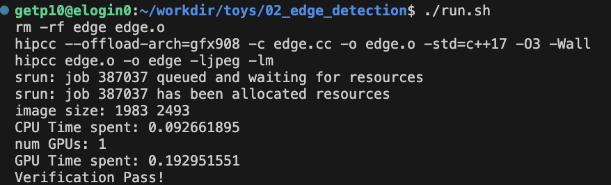
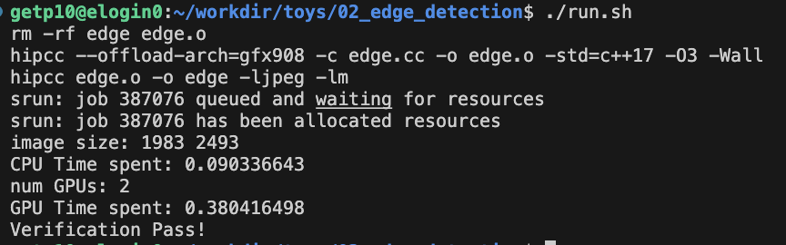
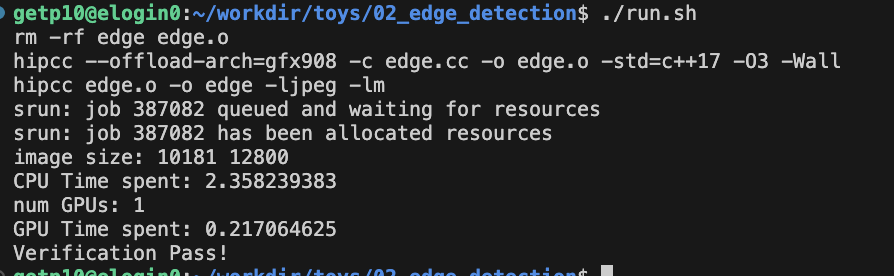
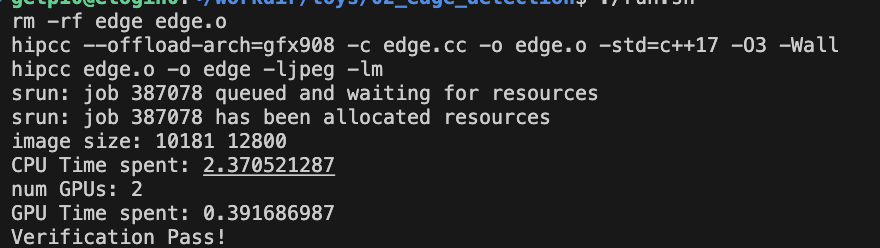

# Toy 02 Edge detection - Nguyen Hoang Thuan

## Solution

In this problem, I'll create a solution which can run in flexible number of gpus. It'll use maximul gpus being allocated when run script.

Because this problem only read input from input image and then directly write result to output image, I'll use the zero memcopy improve performance.

First need to allocate memory in the pinned memory for faster transfer data.

```
CHECK_HIP(hipHostMalloc((void **)&(out.pixels), width * height * sizeof(Pixel), hipMemAllocationTypePinned));
```

To run in multi-gpus, I'll split the image by `npus` parts, each part will be processed in 1 gpu, the image will be splitted by y axis.

```
  int ngpu;
  CHECK_HIP(hipGetDeviceCount(&ngpu));
  printf("num GPUs: %d\n", ngpu);
  int hbegin[1024], hend[1024];
  for (int i = 0; i <= ngpu; i++)
  {
    hbegin[i] = std::max(0, height / ngpu * i + std::min(i, height % ngpu) - 1);
    // printf("%d %d %d\n",h / ngpu * i,std::min(i, h % ngpu),hbegin[i] );
    hend[i] = height / ngpu * (i + 1) + std::min(i + 1, height % ngpu) + 1;
    if (i == ngpu - 1)
      hend[i] = height;
  }
  // hipStream_t streams[ngpu];
  // for (int i = 0; i < ngpu; i++)
  // {
  //   hipSetDevice(i);
  //   hipStreamCreate(&streams[i]);
  // }
  for (int i = 0; i < ngpu; i++)
  {
    CHECK_HIP(hipSetDevice(i));
    dim3 blockdim(BLOCK_SIZE, BLOCK_SIZE);
    dim3 griddim((input.width + blockdim.x - 1) / blockdim.x, (hend[i] - hbegin[i] + blockdim.y - 1) / blockdim.y);
    sobel_kernel_native_unroll<<<griddim, blockdim>>>(&input.pixels[hbegin[i] * input.width], &output.pixels[hbegin[i] * input.width], width, hend[i] - hbegin[i]);
  }
  for (int i = 0; i < ngpu; i++)
  {
    CHECK_HIP(hipSetDevice(i));
    CHECK_HIP(hipDeviceSynchronize());
  }
```

Inside the kernel, I will unroll all loops and replace the `filterX` and `filterY` by constant.

```
__global__ void sobel_kernel_native_unroll(Pixel *input_pixels, Pixel *output_pixels, int width, int height)
{
  int gx, gy;
  int x = blockIdx.x * blockDim.x + threadIdx.x;
  int y = blockIdx.y * blockDim.y + threadIdx.y;
  if (x > 0 && y > 0 && x < width - 1 && y < height - 1)
  {
    Pixel p00, p01, p02, p10, p12, p20, p21, p22; // p11
    int g00, g01, g02, g10, g12, g20, g21, g22;   // g11
    int magnitude;

    p00 = input_pixels[(y - 1) * width + x - 1];
    p10 = input_pixels[x + width * (y - 1)];
    p20 = input_pixels[x + 1 + width * (y - 1)];

    p01 = input_pixels[x - 1 + width * (y)];
    // p11 = input_pixels[x + width * (y)];
    p21 = input_pixels[x + 1 + width * (y)];

    p02 = input_pixels[x - 1 + width * (y + 1)];
    p12 = input_pixels[x + width * (y + 1)];
    p22 = input_pixels[x + 1 + width * (y + 1)];

    g00 = ((int)p00.r + (int)p00.g + (int)p00.b) / 3; 
    g10 = ((int)p10.r + (int)p10.g + (int)p10.b) / 3;
    g20 = ((int)p20.r + (int)p20.g + (int)p20.b) / 3;

    g01 = ((int)p01.r + (int)p01.g + (int)p01.b) / 3;
    // g11 = ((int)p11.r + (int)p11.g + (int)p11.b) / 3;
    g21 = ((int)p21.r + (int)p21.g + (int)p21.b) / 3;

    g02 = ((int)p02.r + (int)p02.g + (int)p02.b) / 3;
    g12 = ((int)p12.r + (int)p12.g + (int)p12.b) / 3;
    g22 = ((int)p22.r + (int)p22.g + (int)p22.b) / 3;

    gx = -g00 + g20 - 2 * g01 + 2 * g21 - g02 + g22;
    gy = g02 + 2 * g12 + g22 - g00 - 2 * g10 - g20;

    magnitude = static_cast<int>(sqrt(gx * gx + gy * gy));
    magnitude = static_cast<unsigned char>(min(max(magnitude, 0), 255));
    // uchar3 mag = make_uchar3(magnitude,magnitude,magnitude);
    output_pixels[x + width * (y)] = {static_cast<unsigned char>(magnitude),
                                      static_cast<unsigned char>(magnitude),
                                      static_cast<unsigned char>(magnitude)};
    // reinterpret_cast<uchar3>((void ) output_pixels[x + width * (y)]) = mag;
  }
}
```

## Experiment result

To run experiment need to run this command

```
srun -p EM --gres=gpu:2 ./edge Very_Big_Tiger_Cub.jpg res.jpg res_hip.jpg 1
```

We can change number of gpus, and the algorithm will automatically split the input image into gpus and run on that device.

Here is the result when run with Big image






And this is result when run with Very Big image





When run with 2 gpu the time is almost double due to overhead when warming up kernel for each GPU.
