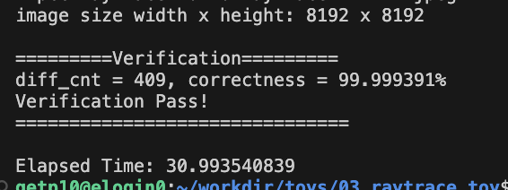
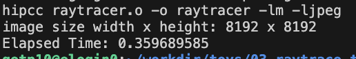
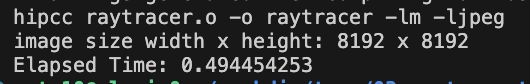
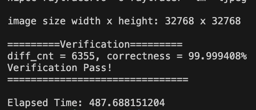
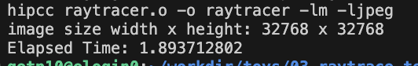
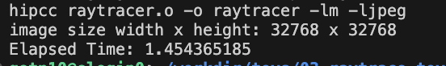

# Toy 03 Raytracing - Nguyen Hoang Thuan

## Solution

### Update Vec3 and Sphere

First to let the object can be call inside GPU kernel, I rewrite the Vec3GPU and SphereGPU, in which the method of each class will has `__device__` keyword.

I also replace `sqrt` with `__fsqrt_rn` to make the sqrt in GPU kernel using the round to neartest mode, which will more accurate when compare result with CPU.

```

template <typename T>
class Vec3GPU
{
public:
  T x, y, z;
  __device__ Vec3GPU() : x(T(0)), y(T(0)), z(T(0)) {}
  __device__ Vec3GPU(T xx) : x(xx), y(xx), z(xx) {}
  __device__ Vec3GPU(T xx, T yy, T zz) : x(xx), y(yy), z(zz) {}
  __device__ Vec3GPU &normalize()
  {
    T nor2 = length();
    if (nor2 > 0)
    {
      // T invNor = 1 / __fsqrt_rn(nor2);
      x = __fdiv_rn(x, nor2), y = __fdiv_rn(y, nor2), z = __fdiv_rn(z, nor2);
    }
    return *this;
  }
  __device__ Vec3GPU<T> operator*(const T &f) const { return Vec3GPU<T>(x * f, y * f, z * f); }
  __device__ Vec3GPU<T> operator*(const Vec3GPU<T> &v) const { return Vec3GPU<T>(x * v.x, y * v.y, z * v.z); }
  __device__ T dot(const Vec3GPU<T> &v) const { return x * v.x + y * v.y + z * v.z; }
  __device__ Vec3GPU<T> operator-(const Vec3GPU<T> &v) const { return Vec3GPU<T>(x - v.x, y - v.y, z - v.z); }
  __device__ Vec3GPU<T> operator+(const Vec3GPU<T> &v) const { return Vec3GPU<T>(x + v.x, y + v.y, z + v.z); }
  __device__ Vec3GPU<T> &operator+=(const Vec3GPU<T> &v)
  {
    x += v.x, y += v.y, z += v.z;
    return *this;
  }
  __device__ Vec3GPU<T> &operator*=(const Vec3GPU<T> &v)
  {
    x *= v.x, y *= v.y, z *= v.z;
    return *this;
  }
  __device__ Vec3GPU<T> operator-() const { return Vec3GPU<T>(-x, -y, -z); }
  __device__ T length2() const { return x * x + y * y + z * z; }
  __device__ T length() const { return __fsqrt_rn(length2()); }
};

typedef Vec3GPU<float> Vec3fGPU;

class SphereGPU
{
public:
  Vec3fGPU center;                      /// position of the sphere
  float radius, radius2;                /// sphere radius and radius^2
  Vec3fGPU surfaceColor, emissionColor; /// surface color and emission (light)
  float transparency, reflection;       /// surface transparency and reflectivity
  __device__ SphereGPU(
      const Vec3fGPU &c,
      const float &r,
      const Vec3fGPU &sc,
      const float &refl = 0,
      const float &transp = 0,
      const Vec3fGPU &ec = 0) : center(c), radius(r), radius2((r * r)), surfaceColor(sc), emissionColor(ec),
                                transparency(transp), reflection(refl)
  { /* empty */
  }

  // Compute a ray-sphere intersection using the geometric solution
  __device__ bool intersect(const Vec3fGPU &rayorig, const Vec3fGPU &raydir, float &t0, float &t1) const
  {
    Vec3fGPU l = center - rayorig;
    float tca = l.dot(raydir);
    if (tca < 0)
      return false;
    float d2 = l.dot(l) - tca * tca;
    if (d2 > radius2)
      return false;
    float thc = __fsqrt_rn(radius2 - d2);
    t0 = tca - thc;
    t1 = tca + thc;

    return true;
  }
};
```

### Run with multi gpu and multi buffer

First I use the zero memcopy method for the image because the raytracing only render and write to each pixel 1 time. For the array of Spheres, I malloc a GPU version of it in each gpu and then copy the data from cpu to each gpu.

The block size I set up it as 64 for x axis and 4 for y axis.

The bottle neck in this pipeline is the malloc image, we have to wait the whole image malloc finish to start computing. To reduce overhead at this step, I split the image into many smaller buffers, after 1 buffer finish allocating memory, I will directly process it and continue for the next buffer. The optimize number buffer for my case is 32.

```
void render_gpu_v2(Vec3fGPU *image[BUFFER_SIZE], const std::vector<Sphere> &spheres, size_t width, size_t height)
{
  // TODO:
  SphereGPU *sphere_gpu[2];

  // hipStream_t streams[BUFFER_SIZE];
  int ngpu;
  CHECK_HIP(hipGetDeviceCount(&ngpu));
  // printf("num GPUs: %d\n", ngpu);
  int hbegin[BUFFER_SIZE], hend[BUFFER_SIZE];
  for (int i = 0; i < BUFFER_SIZE; i++)
  {

    hbegin[i] = std::max(0, (int)height / BUFFER_SIZE * i + std::min(i, (int)height % BUFFER_SIZE) - 1);
    // printf("%d %d %d\n",h / ngpu * i,std::min(i, h % ngpu),hbegin[i] );
    hend[i] = (int)height / BUFFER_SIZE * (i + 1) + std::min(i + 1, (int)height % BUFFER_SIZE) + 1;
    if (i == BUFFER_SIZE - 1)
      hend[i] = (int)height;
  }

  for (int i = 0; i < ngpu; i++)
  {
    CHECK_HIP(hipSetDevice(i));
    CHECK_HIP(hipMallocAsync(&sphere_gpu[i], spheres.size() * sizeof(SphereGPU), hipStreamDefault));

    CHECK_HIP(hipMemcpyAsync((void **)sphere_gpu[i], spheres.data(), spheres.size() * sizeof(Sphere), hipMemcpyHostToDevice));
  }
  // CHECK_HIP(hipHostMalloc(&sphere_gpu, spheres.size() * sizeof(SphereGPU), hipMemAllocationTypePinned));
  // CHECK_HIP(hipMemcpyAsync((void **)sphere_gpu, spheres.data(), spheres.size() * sizeof(Sphere), hipMemcpyHostToHost));
  float invWidth = 1 / float(width), invHeight = 1 / float(height);
  float fov = 30, aspectratio = width / float(height);
  float angle = tan(M_PI * 0.5 * fov / 180.);

  for (int i = 0; i < BUFFER_SIZE; i++)
  {
    CHECK_HIP(hipHostMalloc((void **)&image[i], width * (hend[i] - hbegin[i]) * sizeof(Vec3fGPU), hipMemAllocationTypePinned));
    CHECK_HIP(hipSetDevice(i % ngpu));
    // CHECK_HIP(hipStreamCreate(&streams[i]));
    dim3 blockdim(BLOCK_SIZE_X, BLOCK_SIZE_Y);
    dim3 griddim((width + BLOCK_SIZE_X - 1) / BLOCK_SIZE_X, (hend[i] - hbegin[i] + BLOCK_SIZE_Y - 1) / BLOCK_SIZE_Y);

    raytrace_kernel<<<griddim, blockdim, 0>>>(image[i], width, height, sphere_gpu[i % ngpu], (int)spheres.size(), invWidth, invHeight, angle, aspectratio, hbegin[i], hend[i] - hbegin[i]);
  }
  // Trace rays
  for (int i = 0; i < ngpu; i++)
  {
    CHECK_HIP(hipSetDevice(i));
    CHECK_HIP(hipDeviceSynchronize());
    CHECK_HIP(hipFree(sphere_gpu[i]));
  }
}

```

## Experiment result

| size  | 1 GPU   | 2 GPU   |
| ----- | ------- | ------- |
| 8192  | 0.36 s  | 0.494 s |
| 32768 | 1.894 s | 1.454 s |

This is experiment result for image with size 8192x8192 with validation



This is experiment for image with size 8192x8192 using 1 GPU



This is experiment result for image with size 8192x8192 using 2 gpu



For larger size, 32768x32768 this is the result with validation, 1 gpu and 2 gpu






